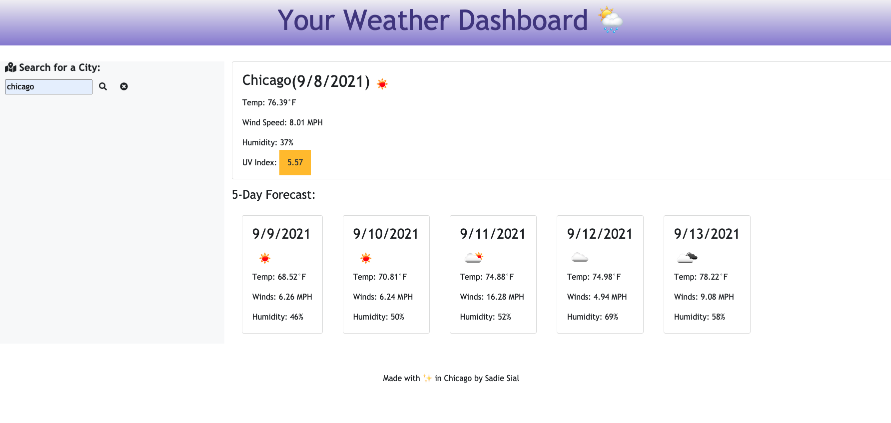
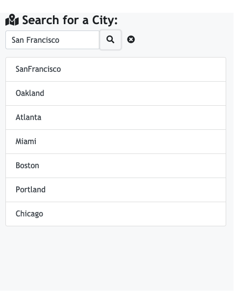

# Weather Dashboard (Bootcamp Assignment 6 - Server Side APIs)

By: Sadie Sial ✨

## User Story
```
AS A traveler
YOU WANT to see the weather outlook for multiple cities
SO THAT YOU can plan a trip accordingly
```


```
In this application the user will be given a weather dashboard with form inputs where they can enter a name of a city, search for that city, and then be presented with the current weather conditions as well the forecast for the next five days. 
The current conditions will display the city's name, date, an icon representation of conditions, the temperature in °F, winds in MPH, the humidity percentage, and a color indicated UV index. 
The UV index will display green for favorable levels 1-2, yellow for moderate levels 3-5, and red for severe levels 6+. 
Beneath the 5-Day Forecast displays the date, an icon for conditions, the temperature, winds, and humidty levels for each day. 
Users will be able to see their previously searched locations in the left sidebar, and can select them to view them all over again. 
```

# Screenshots
```
Main Display
```


```
Previously Searched Display
```



## Links

[Deployed App](https://sadielinks.github.io/weather-dashboard/)


[GitHub Repository](https://github.com/sadielinks/weather-dashboard)

## Technologies Used
- HTML, CSS, Javascript, JQuery, Moment.JS, Bootstrap, JSON, and Open Weather Map ® API.


## Contact Information

- [GitHub Profile](https://github.com/sadielinks)
- [Portfolio](https://sadielinks.github.io/professional-portfolio/)
- [Email](mailto:sadiecodes@gmail.com)


## License

This source code is available to everyone under the standard [MIT License ©](https://github.com/microsoft/vscode/blob/master/LICENSE.txt). <br>

© 2021 Trilogy Education Services, LLC, a 2U, Inc. brand. Confidential and Proprietary. All Rights Reserved.